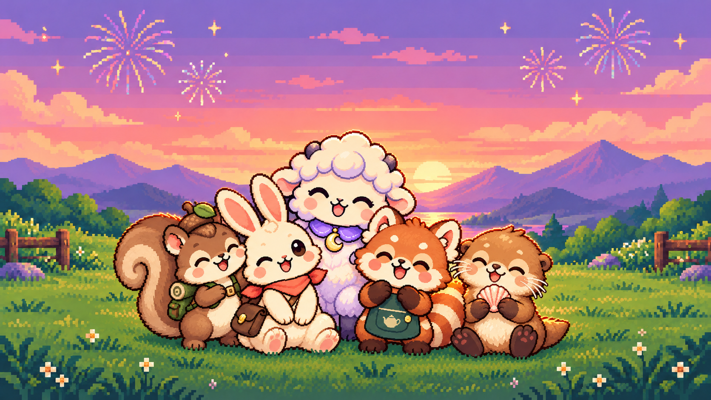

# Five-character bundle celebration artwork

Generated with the built-in image_gen tool on 2026-10-02. This is the standalone bundle illustration requested by the user, not an in-app UI screenshot. The live store card is not changed by this asset delivery.

Includes exactly the five characters in the existing bundle: Postman Rabbit, Explorer Squirrel, Mooncloud Sheep, Red Panda Teashop and Sunny Sea Otter. No price or language-specific text is embedded. Reviewed for five distinct characters, their defining accessories, full framing, and the requested sunset meadow / fireworks mood.

## Final prompt

Use case: illustration-story.
Asset type: polished landscape hero illustration for the existing LOOPET five-character bundle. One finished image, 16:9 landscape, ideally 2048×1152.
Primary request: Create a joyful group portrait of exactly FIVE established app characters, in the same beautiful cozy pixel-art sunset meadow atmosphere as reference image 1.
Input roles: Image 1 is ONLY the scene/style/mood/composition reference. Do NOT include its capybara, alpaca, or raccoon. Images 2, 3, and 4 are authoritative rabbit, squirrel and sheep references. Image 5 is an app screenshot: use ONLY its large orange red-panda teashop artwork and its large seashell-holding otter seaside artwork as the authoritative references for the remaining two animals. Ignore every UI element, text and price, and do not include the poodle at the bottom of that screenshot.
Scene: flower-dotted green meadow with little daisies and subtle wooden fences at the outer edges, distant layered purple mountains and a reflecting lake, apricot-pink sunset clouds transitioning into lavender sky, a few delicate pixel-art fireworks and little gold stars. Match reference 1's warm sunset rim light and peaceful celebratory feeling.
Subjects: exactly these five friends, each clearly separate and recognizable, together in a close cheerful group near the lower center:
1. Cream postman rabbit from image 2, long pink-lined ears, coral neckerchief, brown mail satchel.
2. Brown explorer squirrel from image 3, big curled fluffy tail, acorn cap with green leaf, tiny olive hiking backpack.
3. Cream mooncloud sheep from image 4, round cloudlike wool with lavender shading, little dark hooves, purple collar with GOLD CRESCENT MOON pendant.
4. Orange red panda from image 5's large teashop character card, distinctive white facial markings, orange-and-cream ringed tail, dark green tea-shop apron with its little cream teapot emblem.
5. Honey-brown sea otter from image 5's large seaside character card, cream cheeks and belly, tiny whiskers, holding the recognizable PINK SEASHELL.
Preserve the five reference character designs, proportions, colors and signature accessories. Give them happy natural expressions, leaning toward one another as friends celebrating together, with a mix of open eyes and smiling closed eyes. Keep all five faces, bodies and defining accessories visible; light overlapping is fine without hiding any character. No generic matching collars replacing their original costumes.
Style: high-quality, charming detailed pixel-art illustration with crisp stepped edges, coherent pixel shading, plush round chibi silhouettes, warm highlights and clean dark outlines. Strongly match the scene style of image 1, but the five character identities MUST come from images 2–5. No photorealism, no 3D render, no vector-flat clipart.
Composition: balanced wide scene, the five-character group occupies roughly the central 70% of width and lower 55% of height, all ears and feet inside frame with comfortable margins. Their faces should remain readable at mobile store-card size. Do not put important subjects at the outer edges. The upper sky stays gently open. One cohesive scene, not five separate panels or a sprite contact sheet.
Text: NONE. No title, price, UI, badges, logo, watermark, or lettering.
Avoid: extra animals, duplicates, cats, poodles, raccoons, alpacas, capybaras, cropped ears, cropped feet, merged limbs, mixing character costumes, losing the otter's shell or sheep's moon pendant.

## Reference files

- /var/folders/1d/f_54vtrd34b966kbj7vfrncc0000gn/T/codex-clipboard-64fb232d-d155-4ecd-ad36-bc6817caa8ef.png
- /Users/jaewook/dev_app/routine_app/flutter_app/assets/characters/rabbit_postman/v1/approved/idle.png
- /Users/jaewook/dev_app/routine_app/flutter_app/assets/characters/squirrel_explorer/v1/approved/idle.png
- /Users/jaewook/dev_app/routine_app/flutter_app/assets/characters/sheep_mooncloud/v1/approved/idle.png
- /Users/jaewook/dev_app/routine_app/flutter_app/design/character-pack-store/store-bottom.png
