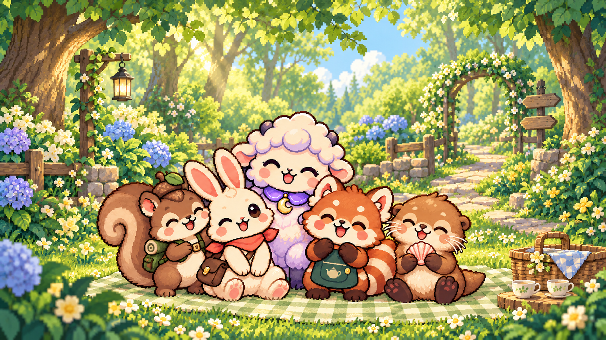

# Five-character bundle: forest picnic v2

Created with the built-in image_gen tool on 2026-10-02 in response to the user's request for a different background. The five-character identities, poses, costumes, and arrangement are preserved. The sunset and fireworks setting is replaced with a sunny woodland picnic garden. Original v1 is retained.

This is a standalone illustration; no live app UI was changed in this iteration.

## Final prompt

Use case: precise-object-edit.
Edit target: the supplied five-character LOOPET group illustration. The user wants a distinctly different background.
Change ONLY the environment/background and its appropriate lighting. Preserve the EXACT same five characters and their identities, existing poses and expressions, relative arrangement, proportions, costumes and accessories: explorer squirrel with acorn hat and green backpack at left, cream postman rabbit with coral scarf and mail satchel, mooncloud sheep with purple collar and gold crescent pendant in the back center, red panda with green teashop apron, and sea otter holding a pink shell at right. Keep all five as in the source. No extra animals.
New environment: a cozy sunny woodland picnic garden in fresh spring daytime, enclosed by tall leafy trees and lush green canopy. This must feel like a new place, NOT a recolor of the old landscape. Dappled pale golden sunlight through leaves; glimpses of clear pale blue sky; a winding warm stone garden path behind the group leading into the green woods; flowering shrubs and hydrangeas, soft moss and little white/yellow wildflowers. A quiet cream-and-sage gingham picnic blanket under the group, with a small wicker picnic basket and two tiny tea cups off to the far side, unobtrusive and not covering feet or characters. Intimate leafy forest-garden depth instead of a distant horizon. The characters remain the clear focal point, with slightly simpler and lower contrast detail behind their faces.
Remove all elements of the original background: NO sunset, NO pink/purple sky, NO fireworks, NO lake, NO layered mountains, NO sunset rim glow, NO original fences. Entirely replace that setting with the daylight forest garden.
Style: preserve the same beautiful detailed pixel-art / cozy chibi storybook rendering, clean dark pixel outlines and plush cute animal forms, warm cream and fresh leafy greens with little pastel blue and yellow floral accents. Integrate natural soft daytime lighting onto the unchanged character shapes; no harsh orange rim light. Crisp coherent pixel shading, not photorealistic, not 3D.
Composition: preserve the original landscape aspect ratio and character group framing, all ears and feet within the canvas, comfortable outer margins. The leafy canopy frames the upper portion. No text, no logo, no price, no watermark or UI. One cohesive finished store hero image.

## Edit target

five-pack-celebration-v1.png

## App integration

Now used by the five-character bundle card in `lib/screens/character_pack_store_screen.dart`, via `assets/store/bundles/five_pack_forest_picnic.png`. The app copy preserves the original bytes and aspect ratio. See `forest-picnic-card.png` for the rendered card.
